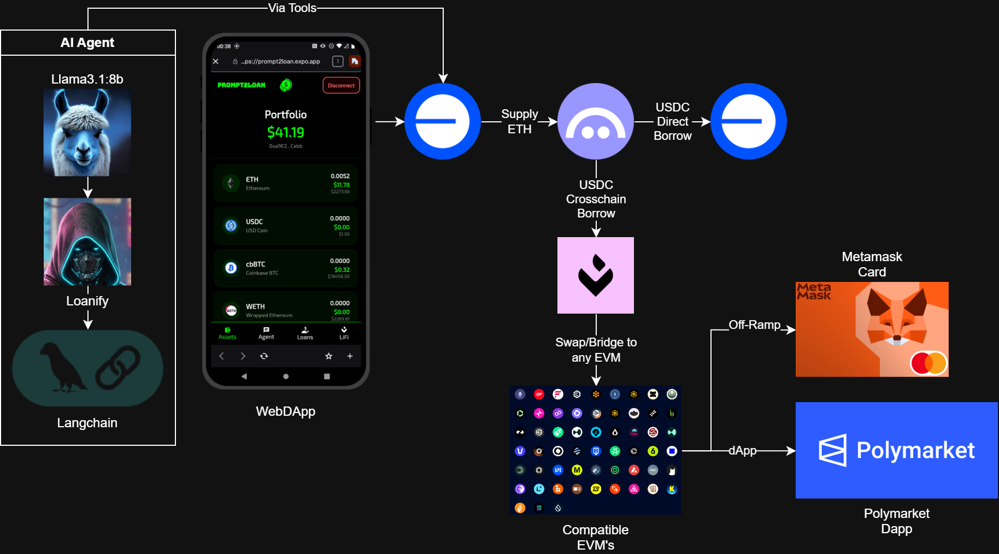
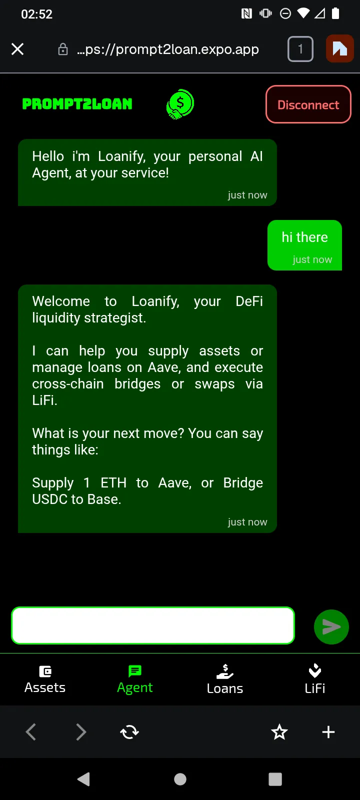
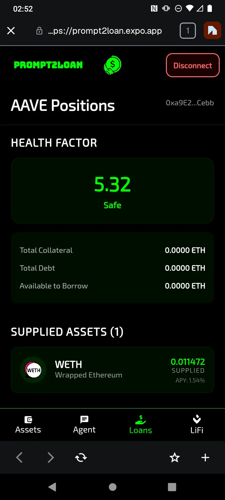
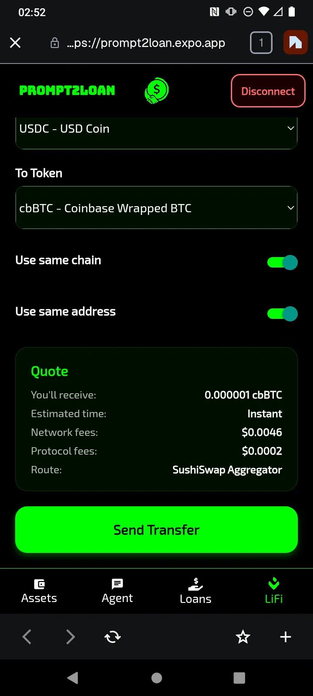

# Prompt2Loan

<p align="center">
  
</p

Prompt2Loan is an AI-native, cross-chain DeFi platform that enables users to obtain crypto-backed loans and move liquidity seamlessly across chains, powered by AAVE v3, Li.Fi, and intelligent agents.

The platform is designed for production use, combining institutional-grade architecture with a clean, mobile-first user experience.

---

# Fast Links

### Live Deployment (Base Mainnet)

* **Web App**: [WEBAPP](https://prompt2loan.app)
* **Demo Video**: [DEMO](pending...)
* **LiFi Agent**: [DOCS](#swaps--cross-chain-transfers-lifi)
* **LiFi UI**: [DOCS](#mobile-dapp)

## System Architecture



Prompt2Loan follows a modular Web3 architecture optimized for scalability and security.

* **Base**: Primary execution layer for lending, borrowing, and payments.
* **AAVE v3**: Core liquidity and lending protocol.
* **Li.Fi**: Cross-chain routing, quoting, and execution.
* **AI Agent Layer**: Decision support, automation, and UX abstraction.

---

## 🤖 AI Agent (LangChain + LangGraph)

Prompt2Loan includes a transaction-native AI Agent built with LangChain and LangGraph, designed to convert natural language intent into safe, executable DeFi transactions.

The agent never signs or broadcasts transactions.
Instead, it prepares validated transaction payloads that are returned to the frontend for explicit user approval.

### Agent Overview

- LLM: LLaMA 3.1 (AWS Bedrock)
- Framework: LangChain + LangGraph
- Memory: Thread-based session memory
- Execution Model: Tool-only responses
- Primary Chain: Base Mainnet
- The agent is exposed via an Express API and optimized for deterministic, production-grade execution.

#### AAVE v3 (Base)

- Supply ETH
- Repay USDC debt (automatic approval handling)
- Withdraw ETH
- Borrow USDC

Prompt: ```Supply 1 ETH to Aave```

Agent tool:
```javascript
const prepareAaveDeposit = tool(
  async ({ amountInEth }, { configurable: { address } }) => {
    try {
      ...
      const voidSigner = new ethers.VoidSigner(address, provider);
      const wethGateway = new ethers.Contract(
        AaveV3Base.WETH_GATEWAY,
        WETHGatewayABI.abi,
        voidSigner,
      );
      const txRequest = await wethGateway.populateTransaction.depositETH(
        AaveV3Base.POOL,
        address,
        0,
        { value: amountWei },
      );
      ...
      return JSON.stringify({
        status: "success",
        last_tool: "prepare_aave_deposit",
        tx: [
          {
            to: txRequest.to,
            data: txRequest.data,
            value: txRequest.value.toString(),
            gasLimit: gasLimit.toString(),
            gasPrice: gasPrice.toString(),
            chainId: 8453, // Base Mainnet
          },
        ],
        message: `I've prepared the transaction to deposit ${amountInEth} ETH into Aave on Base. The estimated gas price is ${ethers.utils.formatUnits(gasPrice, "gwei")} gwei. Please confirm the transaction in your wallet.`,
      });
    } catch (error) {
      ...
    }
  },
  {
    ...
  },
);
```

Full example: [Agent Code](./Agent/index.js)

#### Swaps & Cross-Chain Transfers (Li.Fi)

- Token swaps on Base
- Bridging to supported L1s and L2s
- Optional destination address
- Automatic ERC-20 allowance checks
- Fuzzy matching for chain names (e.g. “arb” → Arbitrum)

Prompt: ```Swap 1,000 USDC to Arbitrum```

Agent tool:
```javascript
const swapOrBridgeTool = tool(
  async (
    {
      fromTokenSymbol,
      toTokenSymbol,
      destinationChainName,
      amount,
      swap,
      toAddress,
    },
    { configurable: { address } },
  ) => {
    try {
      const FROM_CHAIN_ID = 8453; // Origin is always Base
      let toChainId = FROM_CHAIN_ID;
      let displayDestName = "Base";

      if (!swap) {
        const destChain = getBestNetworkMatch(destinationChainName);
        ...
      }
      const fromToken = TokensList.find(
        (t) =>
          t.symbol.toLowerCase() === fromTokenSymbol.toLowerCase() &&
          t.chainId === FROM_CHAIN_ID,
      );
      const toToken = TokensList.find(
        (t) =>
          t.symbol.toLowerCase() === toTokenSymbol.toLowerCase() &&
          t.chainId === toChainId,
      );

      if (!fromToken || !toToken)
        throw new Error("Token symbols not found in supported list.");

      const rawAmount = ethers.utils.parseUnits(amount, fromToken.decimals);

      const quote = await getQuote({
        fromChain: FROM_CHAIN_ID,
        toChain: toChainId,
        fromToken: fromToken.address,
        toToken: toToken.address,
        fromAmount: rawAmount.toString(),
        fromAddress: address,
        toAddress: toAddress || address,
      });

      const txList = [];
      const isNative =
        fromToken.address === "0x0000000000000000000000000000000000000000";

      if (!isNative) {
        ...
      }

      txList.push({
        to: quote.transactionRequest.to,
        data: quote.transactionRequest.data,
        value: isNative
          ? rawAmount.toString()
          : quote.transactionRequest.value || "0",
        chainId: FROM_CHAIN_ID,
      });

      return JSON.stringify({
        status: "success",
        last_tool: "prepare_swap_or_bridge",
        tx: txList,
        message:
          toAddress && toAddress.toLowerCase() !== address.toLowerCase()
            ? `I've prepared a ${swap ? "swap" : "bridge"} to send ${amount} ${fromToken.symbol} to ${toAddress} on ${displayDestName}.`
            : `I've prepared your ${swap ? "swap" : "bridge"} of ${amount} ${fromToken.symbol} on ${displayDestName}.`,
      });
    } catch (error) {
      return JSON.stringify({ status: "fail", message: error.message });
    }
  },
  {
   ...
  },
);
```

Full example: [Agent Code](./Agent/index.js)

#### Fusion Workflow: Borrow → Swap / Bridge

The agent supports composed DeFi actions in a single prompt.

Prompt: ```Borrow 1,000 USDC and bridge it to Arbitrum as ETH```

Agent tool:
```javascript
const borrowAndBridgeTool = tool(
  async (
    { borrowAmountUsdc, toTokenSymbol, destinationChainName, toAddress },
    { configurable: { address } },
  ) => {
    try {
      ...
      // Determine if LiFi is required
      const isLiFi = targetChainId !== BASE_CHAIN_ID || targetSymbol !== "USDC";
      const isBridge = targetChainId !== BASE_CHAIN_ID;
      const isSimpleTransfer =
        !isLiFi &&
        toAddress &&
        toAddress.toLowerCase() !== address.toLowerCase();

      if (isLiFi) {
        // Resolve Target Token on Target Chain
        const toToken = TokensList.find(
          (t) =>
            t.symbol.toUpperCase() === targetSymbol &&
            t.chainId === targetChainId,
        );
        if (!toToken)
          throw new Error(
            `Token ${targetSymbol} not found on ${targetChainName}.`,
          );

        const isNative =
          toToken.address === "0x0000000000000000000000000000000000000000";

        // Get Quote from LI.FI
        const quote = await getQuote({
          fromChain: BASE_CHAIN_ID,
          toChain: targetChainId,
          fromToken: USDC_BASE_ADDRESS,
          toToken: toToken.address,
          fromAmount: targetRaw.toString(),
          fromAddress: address,
          toAddress: toAddress || address, // Use optional recipient or self
        });

        // --- CHECK BALANCE ---

        const tx = await prepareApproval(
          USDC_BASE_ADDRESS,
          address,
          quote.transactionRequest.to,
          borrowAmountUsdc,
        );

        if (tx) {
          txList.push(tx);
        }

        txList.push({
          to: quote.transactionRequest.to,
          data: quote.transactionRequest.data,
          value: isNative ? targetRaw.toString() : "0",
          chainId: BASE_CHAIN_ID,
        });
      } else if (isSimpleTransfer) {
        // SIMPLE TRANSFER LOGIC
        const transferData = await contractUSDC.populateTransaction.transfer(
          toAddress,
          targetRaw,
        );
        txList.push({
          to: USDC_BASE_ADDRESS,
          data: transferData.data,
          value: "0",
          chainId: BASE_CHAIN_ID,
        });
      }
        ...
      return JSON.stringify({
        status: "success",
        last_tool: "borrow_and_bridge",
        tx: txList,
        message: `${finalMessage}\n\n**Please sign the ${txList.length} transaction(s).**`,
      });
    } catch (error) {
      console.error("Borrow Tool Error:", error);
      return JSON.stringify({ status: "fail", message: error.message });
    }
  },
  {
   ...
  },
);
```

Full example: [Agent Code](./Agent/index.js)

## Mobile DApp:

It combines real-time asset tracking, an AI-powered natural language transaction agent, AAVE lending integration, and cross-chain bridging.

### Key Features
- Asset Dashboard: Centralized view of your multi-chain portfolio and balances.

- AI Chat Agent: Execute complex DeFi tasks (swaps, supplies, bridges) using natural language.
  - Source Code: [Agent UI](./Prompt2Loan/src/app/(screens)/tabs/tab2.js)

- AAVE Management: Monitor Health Factor, manage collateral, and track lending/borrowing positions in real-time.
  - Source Code: [AAVE UI](./Prompt2Loan/src/app/(screens)/tabs/tab3.js)

- Cross-Chain Bridge: Move assets between 14+ EVM networks (Ethereum, Arbitrum, Base, Polygon, etc.) with LiFi.

  - Source Code: [LiFi UI](./Prompt2Loan/src/app/(screens)/tabs/tab4.js) 
  - Source Code: [LiFi API](./Prompt2Loan/src/app/api/quote+api.js)

- Smart Transaction Handling: Automated detection of AI "tool calls" that trigger direct wallet interaction for user confirmation.

### UI Screenshots:

  